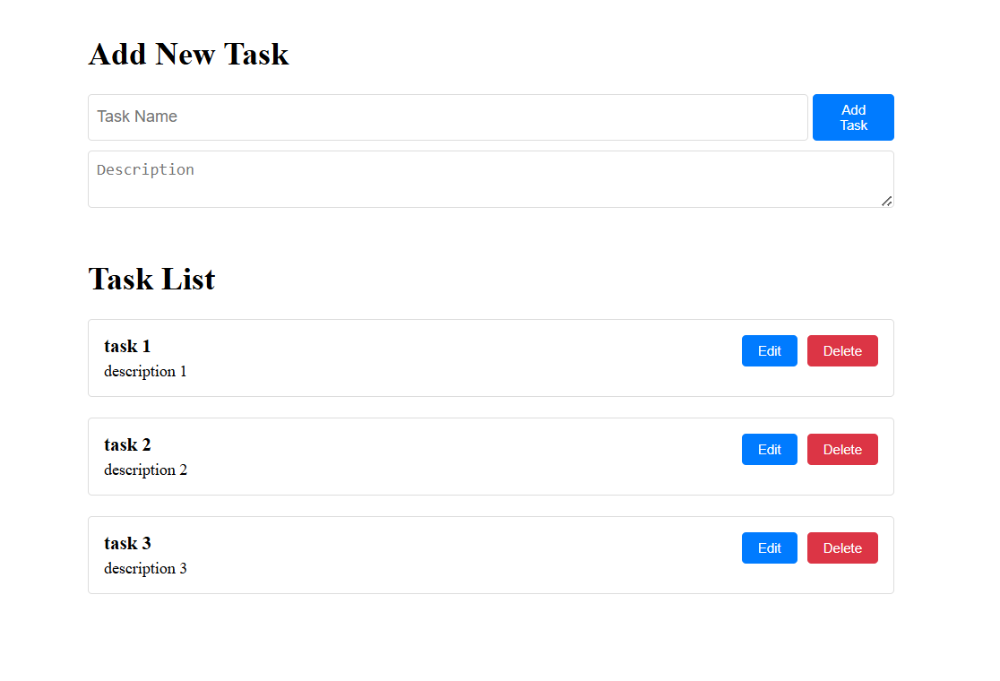

# 📝 Task Management App

A simple fullstack task management application built with **React.js** (frontend) and **Node.js + Express** (backend). Users can add, edit, and delete tasks with a clean and responsive UI.


## 📁 Project Structure
```
task-manager/
├── backend/ # Express backend server
│ └── index.js
│ └── package.json
├── frontend/ # React frontend
│ └── src/
│ └── package.json
└── README.md

```

## 🚀 How to Run the Project Locally
### 1. Clone the Repository
```bash
git clone https://github.com/your-username/task-manager.git
cd task-manager
```

### 2. Setup Backend
```bash
cd backend
npm install
node index.js
```
Server will start on http://localhost:5000.

### 3. Setup Frontend
Open a new terminal:
```bash
cd frontend
npm install
npm start
```

Frontend will run on http://localhost:3000.


## 🔧 API Endpoints (Backend)

- GET /tasks – Fetch all tasks

- POST /tasks – Add a new task

- PUT /tasks/:id – Update a task by ID

- DELETE /tasks/:id – Delete a task by ID


## 🖼️ UI Preview



## 🧪 Tech Stack
- Frontend: React.js, CSS 

- Backend: Node.js, Express

- Others: CORS, Fetch API